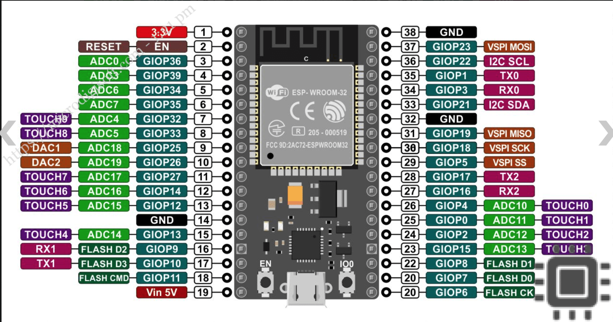
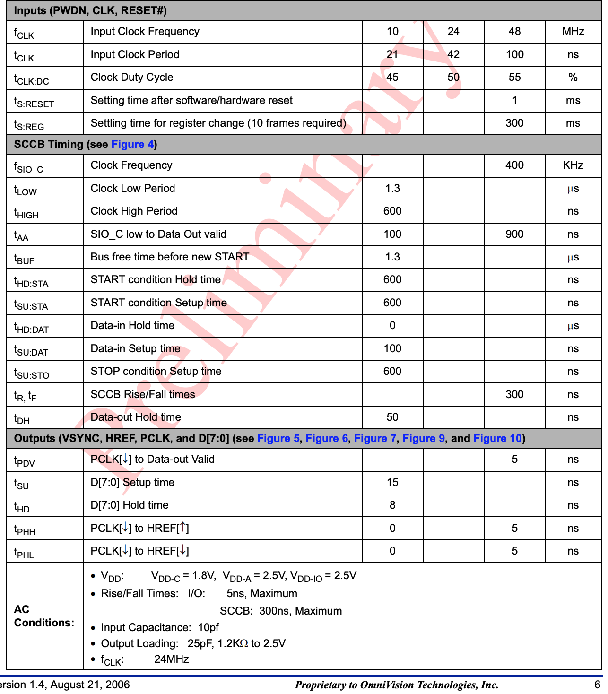

Link has explanation of using OV7670 - https://circuitdigest.com/microcontroller-projects/how-to-use-ov7670-camera-module-with-arduino

I think that will be useful for wiring up the circuit.

# Design Doc

## Goal
To be more familiar with I2C and ESP32 to be able to setup other sensors and devices in the future.

## Prior Work

There are examples online on how to use the OV7670 with a TFT display see [circuit journal article](https://circuitjournal.com/arduino-ov7670-10fps) or [Adafruit example](https://learn.adafruit.com/adafruit-ov7670-camera-library-samd51/arduino-examples). 

## WIP notes

Helpful links where the images are taked from:
- From http://web.mit.edu/6.111/www/f2016/tools/OV7670_2006.pdf
- https://www.openhacks.com/uploadsproductos/ov7670_cmos_camera_module_revc_ds.pdf
- https://www.haoyuelectronics.com/Attachment/OV7670%20+%20AL422B(FIFO)%20Camera%20Module(V2.0)/OV7670%20Implementation%20Guide%20(V1.0).pdf
- https://docs.rs-online.com/ad90/0900766b80cbe14a.pdf

