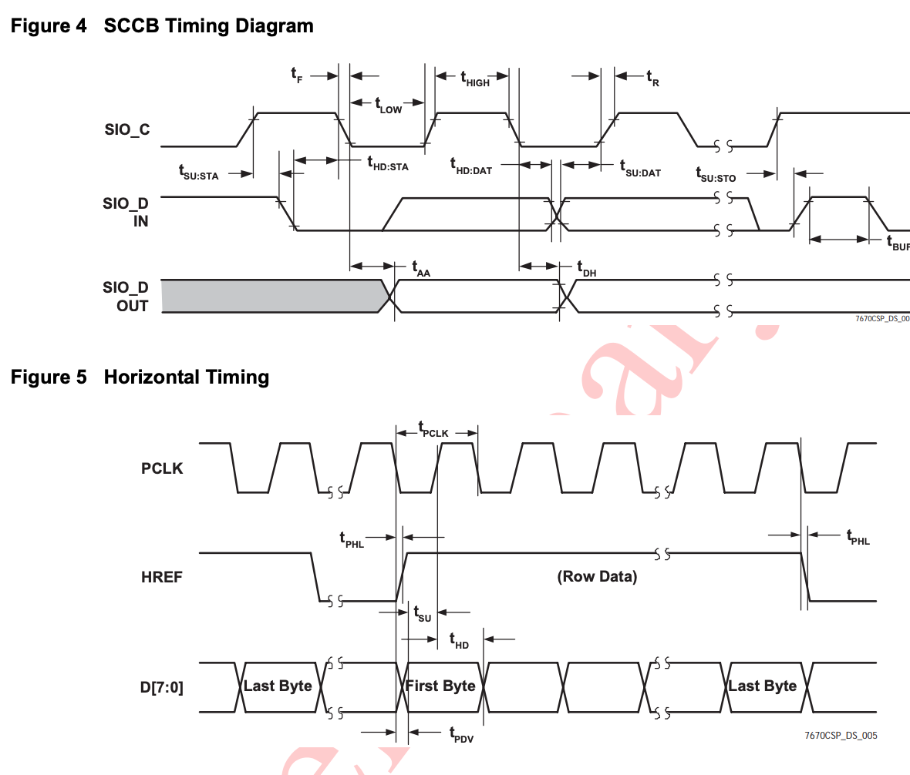

Link has explanation of using OV7670 - https://circuitdigest.com/microcontroller-projects/how-to-use-ov7670-camera-module-with-arduino

I think that will be useful for wiring up the circuit.

# Design Doc

## Goal
To be more familiar with I2C and ESP32 to be able to setup other sensors and devices in the future.

## Prior Work

There are examples online on how to use the OV7670 with a TFT display see [circuit journal article](https://circuitjournal.com/arduino-ov7670-10fps) or [Adafruit example](https://learn.adafruit.com/adafruit-ov7670-camera-library-samd51/arduino-examples). 

## Data Output from OV7670

Data is output in bytes per row of the image. On every 

Timing diagram from page 7 of the datasheet shows that on the rising edge of the pixel clock (pclk) when the horizontal reference (href) is high, the data on the 8 data pins will be valid data for the captured image.

The implementation guide states that "the application uses the rising edge of PCLK to capture data when HREF is high" and "The HREF signal is only valid when there is output data. If there is no output data, the HREF signal will remain at either high or low, depending on the polarity selection" (20). We want to set the polarity to high, so we can generate an event when HREF changes to low, to signal that the buffer contains a full image.

^^ There are some parts (VSYNC, HSYNC, HREF) that still need to be worked out for the above.

For the eventing framework, we can use the [event loop library](https://docs.espressif.com/projects/esp-idf/en/latest/esp32/api-reference/system/esp_event.html) and handle the image outside of the interrupt context.

## WIP notes

Helpful links where the images are taked from:
- From http://web.mit.edu/6.111/www/f2016/tools/OV7670_2006.pdf
- https://www.openhacks.com/uploadsproductos/ov7670_cmos_camera_module_revc_ds.pdf
- https://www.haoyuelectronics.com/Attachment/OV7670%20+%20AL422B(FIFO)%20Camera%20Module(V2.0)/OV7670%20Implementation%20Guide%20(V1.0).pdf
- https://docs.rs-online.com/ad90/0900766b80cbe14a.pdf

